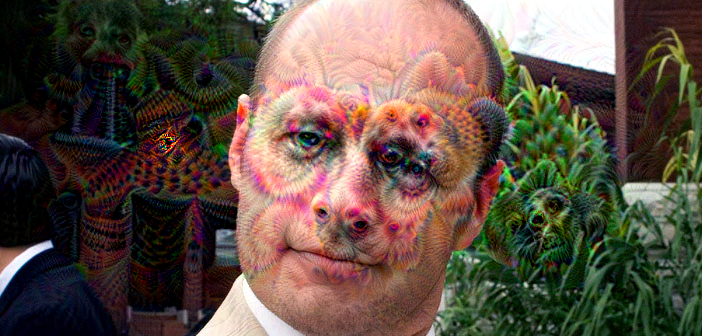

# creep-dreamz

Deep Dream experiments

This project is a "cleaned up" rewrite of [keras Deep Dream](https://github.com/keras-team/keras/blob/master/examples/deep_dream.py).
The project no longer depends on `scipy` module for image manipulation that was replaced by `TensorFlow` native  [tf.image](https://www.tensorflow.org/api_guides/python/image) image manipulation module.

# Usage

usage: creep_dreamz.py [-h] -i INPUT -o OUTPUT [-oct OCTAVE]
                       [-ocs OCTAVESCALE] [-s STEP] [-iter ITERATIONS]
                       [-mxl MAXLOSS]

Creep Dreamz with Keras.

optional arguments:
  -h, --help            show this help message and exit
  -i INPUT, --input INPUT
                        Path to the input data
  -o OUTPUT, --output OUTPUT
                        Path to the output data
  -oct OCTAVE, --octave OCTAVE
                        Number of scales at which to run gradient ascent
  -ocs OCTAVESCALE, --octavescale OCTAVESCALE
                        Size ratio between scales
  -s STEP, --step STEP  Gradient ascent step size
  -iter ITERATIONS, --iterations ITERATIONS
                        Number of gradient ascent steps per scale
  -mxl MAXLOSS, --maxloss MAXLOSS
                        Maximum gradient ascent loss

# Example run

```
python3 creep_dreamz.py -i "random_man.jpg" -o "random_man_creep.png" -oct 4 -ocs 1.4 -s 0.01 -iter 15 -mxl 10.0
```

Original image:


Creep Dreamt image:



[1] Image source: [https://commons.wikimedia.org/wiki/File:Handsome-man-by-Willy-Volk-Creative-Commons.jpg](https://commons.wikimedia.org/wiki/File:Handsome-man-by-Willy-Volk-Creative-Commons.jpg)
